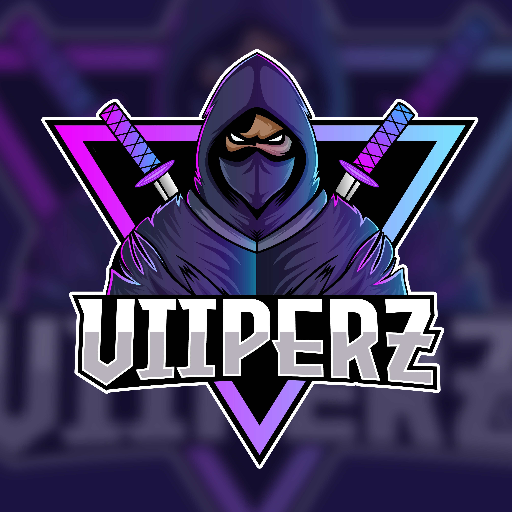

# 🎥 ViiPeRzTTV

## About Me 

Hey! I'm Sean, Also Known As ViiPeRzTTV. I Am The Founder/Project Manager Of ViiPeRz Development. I Oversee All Staff and Development Related Concerns To Anything Within The Community Of ViiPeRz Development, One Of My Biggest Things To Do is Help and Teach People What To Do Within The FiveM Community And This Platfrom Gives Me The Option To Do This.. 

## Why Stream Coding?

* Some People Learn Coding Via Watching Someone Do It Live and Not By Reading Some Code They Don't Understand and Want Some Extra Guideance within The Coding World, My Twitch Streams Will Give People The Support They Need During Me Being Live and Being Able To Help Them Voice to Voice and Support Them During Me Live and Not Struggling To Code It All Them Self

## Stream Scheduel 

Their Is No Specific Time Scheduel, I Can Stream At Different Times Of The Day

If People Miss The Stream All My Previous Stream VOD'S Go Onto My Youtube Channel For The Extra Support When Im Not Live and You Can Watch It All Back 

## Twitch 

* Get Support And Help With Any Code Your Struggling On 
* Answer Any Questions You May Have 

[Twitch](https://www.twitch.tv/viiperz_ttv)

## Youtube 

* Access To Previous Twitch Streams 
* Support Videos 
* How To / Tutorial Videos 

[Youtube](https://www.youtube.com/channel/UCKUC7BT6tsIZrp5d_vestSg)